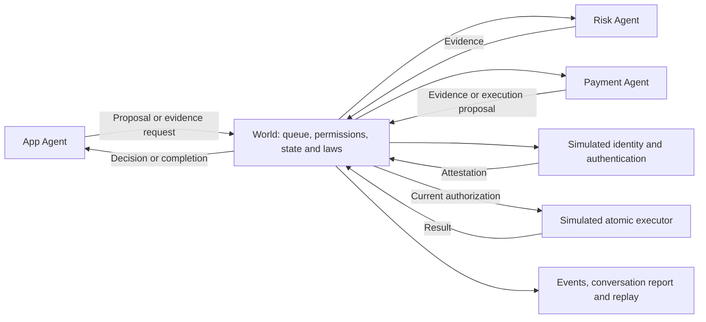

# Lemon

The sibling [Lemonade project](../Lemonade/README.md) is the implementation
sandbox: Next.js/React with JavaScript and a Fastify backend. Lemon explores
behavior; Lemonade turns agreed behavior into working software and verifies it.

`python3 -m lemon exercise --agent anthropic` now lets an actor operate the
actual local Lemonade API, with independently checked responses and replayable
requests. See [software exercises and the first verified fix](docs/software-exercise.md).

A local experiment in agent communication and learning through executable simulations. The new actor experiment connects an App actor's decisions to a fictional transfer World, branch experiments, and reusable strategies. Earlier transfer and software discussion modes remain available.

This implements the communication phase of [the plan](.idea/agent-communication-phase-plan.md). Python 3.9 or newer is required, with no external dependencies. Default commands run locally without LLM calls. Live Anthropic review requires an explicit option or comparison command. There are no real payment connections or automatic code generation.

## Try it

Watch actors enact a transfer, test recovery strategies after a timeout, and retain a verified procedure:

```sh
# Offline demonstration with authored candidates
python3 -m lemon act --fresh

# Anthropic proposes the actions and candidate strategies (paid API calls)
python3 -m lemon act --agent anthropic --fresh

# Reuse the saved strategy when the initial request is lost
python3 -m lemon act --agent anthropic --fault request-lost
```

Add `--team` for independent App and Payment actors with private observations,
messages, experiments, and separate retained procedures:

```sh
python3 -m lemon act --team --fresh --fault processing
python3 -m lemon act --team --agent anthropic --fresh --fault processing --max-api-requests 16
python3 -m lemon act --team --agent anthropic --fault request-lost
```

Use `--joint` to let both actual controllers act inside the same isolated
rehearsal, revise from failures, and adopt a jointly verified procedure:

```sh
python3 -m lemon act --joint --fresh --fault processing
python3 -m lemon act --joint --agent anthropic --fresh --fault processing --max-api-requests 32
```

[Joint rehearsal details](docs/joint-simulation.md) explain the evidence,
shared API budget, and limits. `--joint` implies `--team` and uses separate memory.

The terminal shows actor messages, branch outcomes, and executable checks. In
team mode both roles use Anthropic; without `--team`, only App does. Underlying
banking rules remain scripted. This is a bounded fictional World with no real
payment connections. See [two-actor coordination](docs/team-simulation.md) and
[the actor experiment](docs/actor-simulation.md) for its rules and limitations.

Give the agents your own scenario:

```sh
python3 -m lemon chat --scenario "A booking app for badminton courts. How should we handle two people booking the same slot?"

# Or use a longer scenario from a text file
python3 -m lemon chat --scenario-file my-scenario.txt

# Join the conversation and answer the agents
python3 -m lemon chat --scenario "A food delivery app with order cancellation" --interactive
```

Custom scenarios use your Anthropic configuration for **all four roles** and
make paid API calls. Product considers goals and scope, Backend proposes
mechanics, UI reviews the experience, and Test challenges failure cases. Each
role sees the actual earlier messages in a shared room, including messages
addressed to a specific peer. Two rounds give everyone a chance to respond;
the scheduler takes turns in that fixed order. This is a discussion, with no
transfer-specific rules, domain verification, code generation or execution.
Non-software scenarios are accepted too, though these four perspectives remain.

Use `--rounds 1` for a shorter four-turn discussion. The default is two rounds
(eight turns) with at most eight HTTP attempts, including retries. Longer runs
need a suitable explicit budget, for example `--rounds 3 --max-api-requests 14`.
Provider failures and exhausted budgets save the partial conversation and return
an error. Unresolved user questions appear at the end; no questions does not
imply verified agreement.

With `--interactive`, the agents discuss one round, then you get a `You >`
prompt. Type a decision such as "Allow cancellation only before the restaurant
accepts." Every agent reads your reply and the existing transcript before
responding. Type `/questions` to repeat the open questions, or `/quit` to leave;
EOF also exits. Blank input makes no API call. Questions are refreshed from
each role's latest response; this is model judgment, not a mechanical proof that
every issue was resolved.

Interactive chat defaults to one round per batch. The default eight-attempt
budget covers the opening four turns plus four responses to your feedback when
no retries are needed. The budget is shared across the entire invocation and
does not reset after each reply. Use `--max-api-requests 20` for a longer session.
`--rounds` can explicitly set rounds per batch. Chat saves a new snapshot before
each user prompt; stopping during a model turn saves a replayable partial run.

### Review the shared proposal

Each agent now includes a concise current proposal, unconfirmed assumptions,
explicit disagreements linked to earlier messages, and changes made after your
latest feedback. The terminal shows these updates alongside messages and a
shared proposal at every checkpoint. Type `/proposal` at `You >` to review it
again without an API call.

The shared view contains your original scenario and subsequent statements
verbatim, the latest position from each role, open questions, disagreements,
and reported changes with source message IDs. Your questions are not silently
turned into confirmed decisions. Later corrections remain visible alongside the
earlier statements they change. A role that has not yet responded to your latest
feedback is explicitly marked as awaiting a response, including after failures
or interruption.

Every checkpoint saves a separate `.proposal.md` review document alongside the
transcript. The JSON audit log also stores the proposal in replayable state.
This adds no summary API calls: the structured summary comes with each agent's
existing contribution, and the shared view is assembled locally. Agent summaries
and reported changes still require your review; missing reported disagreements
does not prove consensus, and the view does not grant approval or generate code.

Older saved conversations remain readable and resumable. Their latest messages
appear verbatim until each agent supplies a structured update; missing historical
assumptions or disagreements are not invented.

### Approve a specific proposal version

At `You >`, use `/approve 4` to approve the displayed revision 4, or type
`Approve this proposal.` to approve the currently displayed version. `/versions`
shows the current draft or approval status and the approval history. Approval is
handled locally: it makes no API calls and cannot be granted by an agent.

Each approval records the exact proposal snapshot, revision, content hash and
time. A stale revision is rejected. Open questions, assumptions and disagreements
are preserved in the snapshot: approval accepts that document as shown; it does
not resolve those issues, verify software, or authorize implementation. An empty
proposal cannot be approved. Repeating approval of the same version is harmless.

You can also approve a saved discussion without credentials or model calls:

```sh
python3 -m lemon chat --resume runs/chat/discussion-YOUR-SAVED-RUN.json --approve-revision 4
```

Use the actual revision displayed in your shared proposal. Revisions count
recorded chat messages, so a round can advance several revisions. Approval
itself does not change the revision. New user feedback or agent contributions
create a new draft requiring fresh approval; the older approved snapshot stays
unchanged. Agents receive the latest approved baseline when discussing a change.
For example, type "Change cancellation to allow it before dispatch" or "Resolve
the disagreement about booking holds first" to start revising the proposal.

Checkpoint files include `.approved-rN.md` documents for approved revisions,
alongside the current `.proposal.md` and replay JSON. The current proposal shows
`approved_by_user` only while its contents match an approved snapshot. All
approvals remain in the hash-linked audit history and replay without API calls.
If the interactive model-call budget has ended, use the printed resume command
or `--approve-revision` to approve the saved draft locally.

### Review changes before re-approval

After revising an approved proposal, each checkpoint automatically shows a
change review. Type `/changes` to see it again without model calls. A separate
`.changes.md` file is saved with every checkpoint and the same review is included
in the conversation report.

The review compares the current proposal with the latest earlier approved
version. It shows added, changed, removed and unchanged user statements, role
proposals, assumptions, questions and reported disagreements, with source message
IDs and before/after text. A newer message with identical content is unchanged.
Reworded summaries count as changed; edited list items appear as removal and
addition. This is an exact text comparison, not semantic verification.

All user feedback since that approval is shown, alongside each role's recorded
explanation of changes for each feedback batch. Those explanations are labeled
as agent-reported, not inferred causes. Outstanding disagreements and roles still
awaiting a response remain visible. Removing an objection or question from an
agent's latest response does not prove it was resolved.

The before/after comparison remains available immediately after re-approval.
The next new draft uses that newly approved version as its baseline. Before the
first approval, `/changes` explicitly reports that no approved baseline exists.
Historical approvals, replay data and the original proposal snapshots remain
unchanged. No extra approval step or API calls are introduced.

### Coordinated questions and issue tracking

New discussions use proposal schema 2. The shared proposal groups repeated
questions into one entry with all requesting agents and source messages. Matching
ignores case, repeated whitespace and ending punctuation; it does not guess that
different wording means the same thing. Agents see this question queue and are
instructed to reuse an existing question instead of paraphrasing it. Full messages
remain available in the audit log and `--details`.

Each new disagreement opens an issue with a stable ID, owner, target message,
and open/resolved status. Omission from a later response never closes an issue.
Only its owner can resolve it, with an explicit reason and a later evidence
message. The owner can reopen it with evidence or by explicitly raising the same
objection again. Resolved issues stay in the status history and disappear from
the open-disagreement list. Resolution is the agent's assessment; source checks
do not prove the explanation is correct.

Technical reviewer feedback has a separate input path:

```sh
python3 -m lemon chat --resume runs/chat/discussion-YOUR-SAVED-RUN.json \
  --message "someone else. name and type." \
  --reviewer-feedback "Do not assume a bank reference exists after a timeout."
```

`--reviewer-feedback` also works with a new custom scenario or by itself on
resume. User text is stored as `USER_INPUT`; the critique is stored separately as
`REVIEWER_FEEDBACK`. Reviewer feedback is never an approval or a user requirement.
The proposal and change review label both sources separately. This coordination
adds no model calls beyond the existing agent turns.

Old audit logs, approvals and snapshots retain their original projection and
hashes. Continuing an older conversation creates a new schema-2 draft and tracks
its earlier objections as unresolved until explicitly addressed. Historical
messages that mixed reviewer commentary with user text are not rewritten or
silently reattributed; use a new conversation with separate inputs to correct
that provenance. The DuitNow regression tests cover repeated questions, missing
reference assumptions, explicit resolution, reopening, and feedback attribution.

Continue later with the resume command printed by the CLI:

```sh
python3 -m lemon chat --resume runs/chat/discussion-YOUR-SAVED-RUN.json

# Supply one reply directly, without a prompt
python3 -m lemon chat --resume runs/chat/discussion-YOUR-SAVED-RUN.json --message "Allow cancellation only before acceptance."
```

Resuming verifies the saved history before requesting feedback or making API
calls, retains earlier event hashes and messages, and saves a new file without
overwriting the source. A new invocation has a new explicit request budget;
reports also retain the cumulative request count. Resume uses your currently
configured Anthropic model and records it. Even a partially completed round
resumes with a fresh round after your feedback, preserving completed responses.
History is kept intact; conversations that exceed the 200,000-character request
context limit stop with `CONTEXT_LIMIT_REACHED` instead of silently dropping
earlier decisions. Resume is available only for custom scenario discussions.

Each discussion saves uniquely named Markdown and replay JSON files in
`runs/chat/`; the CLI prints the replay command. Replaying makes no API calls.
`--scenario`, `--scenario-file`, and `--resume` are alternatives to a saved replay file or
transfer variant. `--reviewer` applies to the transfer demo; custom scenarios
always use Anthropic for every role. Default `chat` without a scenario still
runs the local transfer design demo below.

Watch agents talk in your terminal:

```sh
# Live local demo: Product, Backend, UI and Test negotiate a design
python3 -m lemon chat

# Live Anthropic Test Agent, using .env.local (paid API calls)
python3 -m lemon chat --reviewer anthropic

# Watch a saved conversation again, without API calls
python3 -m lemon chat runs/comparison/design-anthropic-negotiated-seed-7.json
```

The scrolling viewer colors each agent and shows delivered messages, challenges,
contract revisions, rejected stale votes, and current approvals. World routes and
validates the messages. Anthropic supplies the Test Agent only; other roles use
local rules. Model messages appear once complete, not token by token.

Use `--details` for full payloads and proposed tests, `--delay 1` for slower
playback, or `--delay 0` for immediate output. Scroll back in your terminal to
review the conversation; Ctrl+C stops it. `--no-color` and `NO_COLOR` disable
colors; piped output automatically omits colors and playback delays. Live runs
save to `runs/chat/` when complete; interrupted runs are not saved. Saved chats
are verified against their hash chain and final state before playback, and
support both design and transfer conversations. `--variant missing-decision`
shows a conversation that needs human input.

From this repository:

```sh
python3 -m lemon list
python3 -m lemon run high-risk --show
python3 -m lemon suite
```

Open [the generated review index](runs/review/index.md) after running the suite. Each scenario produces a readable Markdown conversation, a quality report, and a JSON run containing all evidence and events.

Suggested conversations to inspect:

- [High risk: authentication before execution](runs/review/high-risk-seed-7.md)
- [Expired evidence: request a fresh attestation](runs/review/expired-evidence-seed-7.md)
- [Conflict: explicitly escalate uncertainty](runs/review/conflicting-evidence-seed-7.md)
- [Duplicates: avoid repeated effects](runs/review/duplicate-delivery-seed-7.md)
- [Unavailable provider: stop after bounded retries](runs/review/unavailable-provider-seed-7.md)
- [Competing transfers: prevent spending the same balance twice](runs/review/competing-transfers-seed-7.md)

Generated files live in ignored `runs/`; the source and scenario definitions are sufficient to regenerate them. Amounts are integer simulated currency units, not floating-point money.

## Software-design conversations

```sh
python3 -m lemon design --show
python3 -m lemon design --variant all
python3 -m lemon replay runs/design/design-negotiated-seed-7.json
```

Start with [the recorded design conversation](runs/design/design-negotiated-seed-7.md) or [all design variants](runs/design/index.md). A [guided walkthrough](docs/communication-walkthrough.md) connects the transfer conversation to the design experiment.

Product proposes requirements. Backend proposes an intentionally incomplete interface. UI and Test inspect it, challenge missing states and unsafe success/retry semantics, and Backend revises it. Every revision clears prior approvals; all four roles must approve the same version. Late votes for older versions cannot establish agreement.

Each run produces:

- A Markdown conversation showing actual agent statements and contract revisions.
- A `.spec.json` containing requirements, the current interface, UI states, planned acceptance cases, approvals, and unresolved questions.
- A `.json` audit log supported by the existing replay command.

The variants are `negotiated`, `missing-decision`, `silent-reviewer`, `duplicate-delivery`, and `repair-demo`. Missing product input and missing reviews remain incomplete outcomes. Agreement now requires both current approvals and a passing design-model verification.

## Watch a failed check get repaired

```sh
python3 -m lemon chat --variant repair-demo
```

The local demo deliberately proposes an incorrect retry assertion: a pending
transfer supposedly becomes completed just by retrying. All roles approve, but
World's verifier rejects the case, removes Test's approval, and sends Test a
`VERIFICATION_FEEDBACK` message. Test corrects the assertion; World reruns the
checks before declaring agreement. `--details` shows the rejected artifact and
its replacement.

Contract failures go to Backend; UI mapping failures go to UI; case failures go
to Test. A contract revision clears every approval. There are at most three
repair rounds across the conversation; unresolved failures become `needs_review`
with specific questions. Message and provider-call budgets also remain in force.

`python3 -m lemon chat --reviewer anthropic` uses the same verification gate and
sends diagnostics plus the rejected artifact back to Anthropic when needed.
The deliberate fault in `repair-demo` belongs to the local Test Agent; choosing
Anthropic replaces that agent and does not inject the demo fault into its output.

Checks cover explicit state transitions, input/retry/success rules, UI mappings,
requirement coverage, and structured test assertions. These execute against a
bounded **design model**, not generated application code. Structured assertions
are authoritative; explanatory prose is not semantically verified. See
[verification behavior and limits](docs/design-verification.md).

This exercise uses programmed local review rules and produces design artifacts. The agents have not generated application code or executed the planned feature tests. The initial feature and proposed interface are deliberately bounded; this is not arbitrary natural-language software design.

## Anthropic reviewer and comparison

Set `ANTHROPIC_API_KEY` and `ANTHROPIC_MODEL` in `.env.local` or the process environment. Process environment values take precedence. The file is read as configuration, never executed; `.env` files are ignored by Git. Your chosen model is used as configured, without substitution.

```sh
# One live model-backed conversation
python3 -m lemon design --reviewer anthropic --show

# Deterministic baseline plus a live Anthropic run of the same scenario
python3 -m lemon compare

# Reconstruct a saved model-backed run without calling the API
python3 -m lemon replay runs/comparison/design-anthropic-negotiated-seed-7.json
```

These live commands send the bounded feature requirements, current contract, revision, and cancellation scope to Anthropic. They do not send repository files, environment contents, scenario expectations, or the API key in the prompt. The key is used only for HTTPS authentication. Only the Test Agent is replaced; the other roles and World checks stay deterministic.

The adapter uses the [Anthropic Messages API](https://platform.claude.com/docs/en/api/messages/create) with a [named review tool](https://platform.claude.com/docs/en/agents-and-tools/tool-use/define-tools). It validates the returned tool input, allowed decisions, revision, issue codes, and test case fields before constructing a message. A model response can challenge, accept, or escalate; it cannot execute code or transfers. No deterministic approval is substituted if the API fails or the response is invalid.

Default limits are six distinct model reviews and eight HTTP attempts per conversation, including at most one retry for a rate-limit/server error. Each request has a 30-second socket timeout and a 2,048-output-token limit. Override the HTTP bound with `--max-api-requests` and the timeout with `--api-timeout` (maximum 60 seconds). Repeated observations reuse a validated review within the same run. `--variant all` applies those bounds separately to each scenario; missing-input and silent-reviewer cases may need no model calls.

Read the [comparison report](runs/comparison/comparison-negotiated-seed-7.md), [actual Anthropic conversation](runs/comparison/design-anthropic-negotiated-seed-7.md), and [review notes](docs/anthropic-reviewer.md). Reports include API attempts, provider-reported token usage, model latency, validation failures, and unanswered questions. Failed requests without usage are counted separately; reported token totals may exclude them. No dollar-cost estimate is inferred.

The normal test suite uses fake transports and never calls Anthropic, even when `.env.local` is present. Its fixtures verify the integration and failure boundaries, not the quality of a live model. A live comparison provides additional evidence for the specific captured run; prose test cases still need semantic review.

Both domains use the same versioned message envelope, `Action` structure, and hash-linked event/replay infrastructure. Design uses domain-specific messages (`PROPOSE_REQUIREMENTS`, `PROPOSE_CONTRACT`, `REVIEW`, `CHALLENGE`, `ACCEPT`, `ESCALATE`) and its own permission checks. Its in-process queue uses a seeded schedule and a 120-message work budget. When no messages or work remain but agreement is incomplete, it records the missing reviews/questions instead of waiting indefinitely.

## How it works



Agents make local decisions from restricted copies of relevant observations. They cannot directly change the ledger or authorize a transfer. The App Agent requests missing evidence; Risk assesses amount and device trust; Payment reports balance and requests authorization when evidence appears sufficient. Identity and authentication are simulated capabilities.

The World routes messages and enforces constraints. It does not encode a fixed identity → balance → risk → authentication workflow. Independent requests can be in flight together, and a seeded scheduler varies delivery order. High-risk paths require authentication; low-risk paths do not.

This phase demonstrates programmed local decisions and coordination. It does not claim that the agents have learned new behavior.

## Communication and evidence

Messages have schema version `1`, IDs, conversation and subject IDs, sender, recipient, timestamp, type, typed payload, and optional correlation and explanation fields. Evidence requests also have deadlines. See [contract validation](lemon/contracts.py) for the exact fields and permissions.

Supported types are `PROPOSE`, `REQUEST_EVIDENCE`, `PROVIDE_EVIDENCE`, `CHALLENGE`, `DECISION`, `ESCALATE`, and `COMPLETE`.

```sh
python3 -m lemon contracts
```

Evidence includes its authorized producer, source, user and transaction binding, value, validity interval, and source-state version. The simulated host keeps an issuance registry; a participant cannot invent or modify another provider's attestation. Negative evidence is a valid observation, not missing evidence.

Routing acceptance does not imply evidence acceptance or action authorization. Reports show the separate decisions. At execution, evidence and ledger state are checked again, and balance-check/debit happens in one synchronous operation. Duplicate deliveries keep their message ID and cannot cause a second debit. Unresolved current evidence conflicts lead to escalation.

The host and simulated providers are trusted Python code. This is not a process sandbox, cryptographic identity system, or production payment engine. Hash-linked logs detect changes relative to their recorded chain; they are not independently signed proof of provenance.

## Quality and bounded work

The evaluator is separate from agent decisions. Expected outcomes never enter the agents' observations or runtime configuration. It checks outcomes, authorization evidence, fund conservation, exactly-once effects, retry bounds, traceability, and replay.

Reports separately show message count, rejected messages, retries, suppressed redundant requests, agent invocations, incomplete tasks, logical time, and actual runtime. There is no combined quality score or claim of LLM cost savings. The explanations are observable summaries, not private model reasoning.

Defaults are a 50-message processing budget per conversation, two retries per evidence requirement, and a 20-tick request timeout. The terminal notification and already-queued rejected/duplicate deliveries are visible in the transcript, so total sent/delivered messages can exceed the work budget. Timers use a logical clock and never sleep. An unanswered request uses three attempts in total, then times out. Evidence refresh attempts share the same finite per-requirement limit.

**PASS means the scenario behaved as expected.** A blocked transfer, escalation, or timeout can pass its fault test while still being an unsuccessful or incomplete task. Human review is still needed to judge the clarity and usefulness of the conversation.

## Reproduce and replay

```sh
python3 -m lemon suite --seed 0 --seeds 30 --output runs/validation
python3 -m lemon replay runs/review/high-risk-seed-7.json
python3 -m unittest discover -s tests -v
```

For deterministic agents, the same seed and configuration produce identical logical events. Actual runtime is recorded outside the deterministic trace and naturally varies. Fresh Anthropic responses and recorded model latency can vary even with the same scheduler seed. Replay verifies the stored hash chain and before-states, reconstructs domain state, and compares it with the saved final state. It does not call agents, providers, or the executor.

Replay is state reconstruction, not resumption of a running conversation. Transient scheduler queues and pending timers are not restored as live processes.

## Extend the experiment

To add a scenario, add an entry in [scenarios.py](lemon/scenarios.py) with inputs and independent expected outcomes. Inputs describe balance, transaction amounts, trust, provider results, limits, and an optional fault. Expected outcomes specify terminal statuses, execution count, required rejection/reason, and expected risk. Register any new fault behavior explicitly in the simulator. The suite and seeded regression test automatically include registered scenarios.

To add an agent:

1. Implement an identity and `decide(message, view)` that returns `Action` proposals in [agents.py](lemon/agents.py).
2. Define its capabilities and message permissions in [contracts.py](lemon/contracts.py).
3. Register it in `World.agents`, expose only necessary observations in `World.view`, and define any trusted provider adapter it needs.
4. Add scenarios and independent assertions for its intended behavior and prohibited actions.

Changes to permitted effects still require explicit runtime enforcement. Free-text explanations cannot create new permissions. The Anthropic Test Agent demonstrates replacing one decision function while preserving the structured contract and independent checks.

## Source map

| File | Responsibility |
|---|---|
| `lemon/contracts.py` | Versioned messages, evidence, capability definitions, permissions |
| `lemon/agents.py` | Local agent decisions and deliberately faulty loop participant |
| `lemon/runtime.py` | World, seeded queue, fault injection, providers, executor |
| `lemon/scenarios.py` | Scenario inputs and separate expectations |
| `lemon/events.py` | Event recording and replay reducer |
| `lemon/evaluation.py` | Independent outcome and invariant checks |
| `lemon/reporting.py` | Readable conversations and quality reports |
| `lemon/__main__.py` | CLI |
| `tests/test_simulator.py` | Scenario, trust-boundary, replay, and CLI regressions |
| `lemon/design_agents.py` | Product, Backend, UI, and Test local review decisions |
| `lemon/design.py` | Versioned design negotiation, domain contracts, and permission checks |
| `lemon/design_evaluation.py` | Independent specification and review-provenance checks |
| `lemon/design_reporting.py` | Design conversations and specification export |
| `tests/test_design.py` | Negotiation, stale approvals, incomplete outcomes, and replay tests |
| `lemon/anthropic_reviewer.py` | Secret-safe configuration, bounded HTTP client, and validated model reviews |
| `tests/test_anthropic_reviewer.py` | Offline provider, error, budget, configuration, and comparison regressions |

The long-term direction remains in [the original build plan](.idea/emergent-software-build-plan.md). Agents that write and test application code, broader model evaluation, and behavior compilation are later phases.
